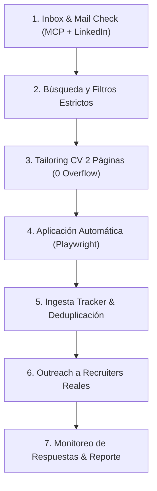

# /search-jobs — Flujo Maestro Autónomo de Búsqueda y Postulación

Ejecuta el ciclo integral autónomo de 7 fases de Insanus-Jobs para el candidato configurado en `config/profile.yml`:



---

## Reglas Mandatorias del Candidato

* **Fuente de Verdad:** `config/profile.yml` (creado a partir de `config/profile.example.yml`).
* **Datos Personales y Contacto:** Nombre, correo electrónico y teléfono se resuelven dinámicamente desde `config/profile.yml`.
* **Formación y Experiencia:** Obtenidos de `cv.md` / `config/profile.yml`.
* **Stack Principal:** Backend, APIs, microservicios, bases de datos e IA según el perfil configurado.
* **Filtros Estrictos de Ubicación:** Modalidad remota o ubicaciones habilitadas en `config/profile.yml`.
* **Piso Salarial:** Definido en `compensation.minimum` del archivo de configuración.
* **Exclusiones:** Descartar automáticamente puestos administrativos sin responsabilidad técnica.
* **Año de Graduación / Dropdowns:** Resuelto según `expected_graduation`.

---

## Las 7 Fases de Ejecución

### Fase 1: Chequeo Integral de Respuestas de Recruiters y Correo
1. Ejecutar el monitor unificado de respuestas y la inspección profunda de inbox:
   ```bash
   node scripts/check_recruiter_responses.mjs
   node scripts/check_linkedin_inbox.mjs
   ```
2. **Inspección de tres canales clave:**
   * **Gmail (vía Google Workspace MCP oficial):** Revisa el correo configurado buscando invitaciones a entrevistas, llamadas de screening o pruebas técnicas.
   * **LinkedIn Messaging & Notificaciones (vía `scripts/check_linkedin_inbox.mjs`):** Extrae mensajes directos de reclutadores, estados de lectura y notificaciones de perfil en tiempo real.
   * **Invitaciones Enviadas en LinkedIn (vía `scripts/check_linkedin_inbox.mjs`):** Monitorea las solicitudes de conexión enviadas a recruiters reales, controlando cuáles siguen pendientes, notas adjuntas y cuáles fueron aceptadas.
3. **Actualización automática del Tracker:** Si una empresa o reclutador respondió, actualiza su estado en `data/applications.md` de `Applied` a `Responded` o `Interview`.
4. Si se detecta una respuesta que requiere acción (ej: coordinar entrevista o responder preguntas), alertar inmediatamente al usuario antes de avanzar con nuevas búsquedas.

### Fase 2: Búsqueda y Selección de Oportunidades
1. Buscar vacantes activas en LinkedIn Easy Apply y portales target utilizando la sesión autenticada `data/session/persistent_chrome`.
2. Aplicar los filtros canónicos:
   * Roles: Junior Backend Developer, Desarrollador Jr, Automatización + IA, etc.
   * Ubicación: Remoto o ciudades objetivo.
   * Salario: Superior o igual al piso establecido en `config/profile.yml`.
3. Evaluar el fit de las vacantes (Score A-G). Seleccionar únicamente aquellas con **Score $\ge$ 4.0/5**.

### Fase 3: Confección de CVs Adaptados de 2 Páginas
1. Para cada puesto seleccionado, generar un CV HTML a medida basado en `templates/cv-template.html`.
2. Destacar proyectos y fortalezas alineados con la descripción del puesto.
3. **Verificación obligatoria de paginación:**
   * Ejecutar `node scripts/check_cv_format.mjs [path_al_html] 2`.
   * Debe tener **EXACTAMENTE 2 páginas con 0 desbordes (overflow: 0px)**.
4. Compilar el PDF final con `node generate-pdf.mjs` hacia `output/cv-[empresa]-[rol].pdf`.

### Fase 4: Postulación y Formulario Automático
1. Conectar a Chromium persistente (`data/session/persistent_chrome`).
2. Abrir cada vacante en LinkedIn.
3. Adjuntar el PDF adaptado exacto generado en la Fase 3.
4. Responder cuestionarios de screening con los datos del perfil del candidato.
5. Capturar screenshots de revisión final y confirmación de envío en `data/session/[slug]_submitted_success.png`.

### Fase 5: Ingesta en el Pipeline Tracker
1. Crear el reporte de evaluación en `reports/{num}-{company-slug}-{YYYY-MM-DD}.md` incluyendo bloques de fit, legitimidad y link al CV.
2. Escribir el archivo TSV en `batch/tracker-additions/{num}-{company-slug}.tsv` (columnas: num, date, company, role, status, score, pdf, report, notes).
3. Ejecutar `node merge-tracker.mjs` para fusionar con `data/applications.md`.
4. Ejecutar `node verify-pipeline.mjs` asegurando **0 errores en el pipeline**.

### Fase 6: Outreach a Recruiters Reales
1. **Regla de Oro:** **ESTRICTAMENTE PROHIBIDO inventar o asumir direcciones de correo electrónico corporativas genéricas** (como careers@, hiring@, talent@, empleos@).
2. Si la empresa o el aviso NO provee una dirección de correo real verificada (o no se ha recibido un correo genuino de un reclutador con dirección real):
   * Buscar en LinkedIn al reclutador/a real de IT o Talent Acquisition de la compañía.
   * Enviar solicitud de conexión en LinkedIn con nota personalizada directa (máximo 300 caracteres, concisa y profesional).
3. Si existe una dirección de correo explícita y verificada de un reclutador o empresa:
   * Redactar el correo formal de presentación y **ENVIARLO DIRECTAMENTE** vía Google Workspace MCP (usando `gmail.send`), **NUNCA dejarlo varado en la carpeta de borradores**. Guardar confirmación en `data/session/outreach_sent.json`.

### Fase 7: Monitoreo Final y Confirmación de Recepción
1. Ejecutar `node scripts/check_linkedin_inbox.mjs` y revisión de Gmail para verificar confirmaciones de recepción (LinkedIn receipt, emails automáticos de acuse de recibo de las empresas) y el estado actualizado de las invitaciones a reclutadores.
2. Generar un informe ejecutivo al usuario detallando:
   * Vacantes postuladas y comprobantes.
   * Solicitudes de conexión y notas enviadas a recruiters reales.
   * Confirmaciones de recepción recibidas.
   * Estado de salud del tracker y próximos pasos recomendados.
