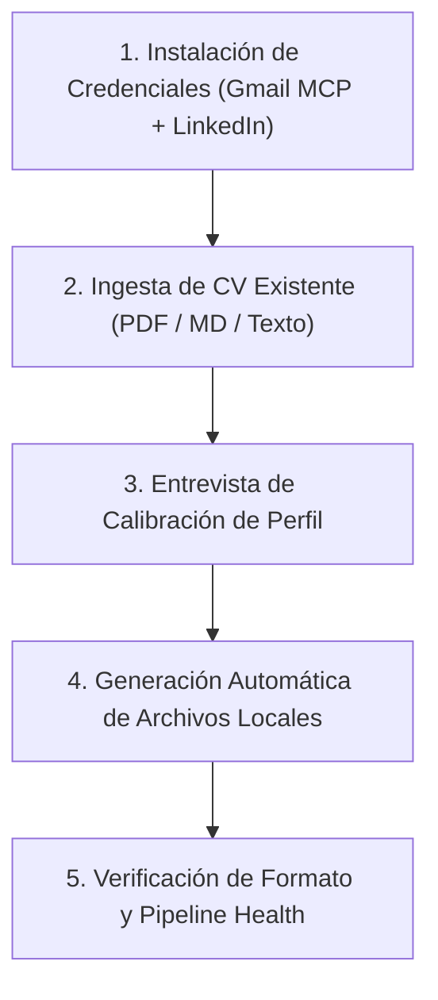

# /setup — Flujo Interactivo de Onboarding y Configuración Inicial

Este flujo prepara el sistema desde cero para un nuevo candidato o una nueva máquina, asegurando que todas las credenciales queden resguardadas de forma segura (100% fuera de Git) y que el perfil profesional quede calibrado para el flujo autónomo `/search-jobs`.



---

## Directivas Maestras para el Agente

1. **Privacidad Absoluta:**
   - Todo archivo con datos reales del usuario (`config/profile.yml`, `cv.md`, `cv.html`, `data/applications.md`, `config/portals.yml`, `cookies.json`, `data/session/`) **DEBE permanecer gitignorado**.
   - Los tokens de OAuth de Google Workspace se escriben en `~/.gemini/extensions/google-workspace/` (fuera del workspace).
   - NUNCA subas estos datos a Git.

2. **Interacción Proactiva y Guiada:**
   - Si el usuario ejecuta `/setup` o pide configurar sus credenciales y CV, guiá el proceso fase por fase.
   - Podés usar la herramienta `ask_question` para opciones múltiples y pedir que peguen tokens o adjunten su CV en el chat.

---

## Las 5 Fases del Workflow `/setup`

### Fase 1: Configuración de Credenciales

Explicá brevemente al usuario qué credenciales se necesitan y para qué:
* **Gmail (Google Workspace MCP):** Para monitorear respuestas de recruiters y enviar correos de presentación oficiales sin intermediarios.
* **LinkedIn (Sesión Playwright):** Para postularse en Easy Apply con emulación humana y conectar con reclutadores.

#### 1.1 Configurar LinkedIn (3 Métodos Disponibles):
Ofrecé al usuario la opción que le resulte más cómoda:
* **Método A (Rápido — Pegar cookie `li_at`):**
  - El usuario abre LinkedIn en su navegador, presiona `F12` -> `Application` -> `Cookies` -> copia el valor de `li_at` y te lo pega en el chat.
  - El agente ejecuta:
    ```bash
    node scripts/linkedin_session.mjs set-liat "<valor_li_at_pegado>"
    ```
* **Método B (Completo — Exportar `cookies.json`):**
  - El usuario usa una extensión como *Cookie-Editor*, exporta las cookies de LinkedIn en JSON y te pega el JSON o lo guarda como `cookies.json`.
  - El agente lo guarda en `cookies.json` y ejecuta:
    ```bash
    node scripts/linkedin_session.mjs import cookies.json
    ```
* **Método C (Ventana interactiva de login):**
  - Si el usuario prefiere loguearse con su usuario y contraseña en una ventana real de Chrome:
    ```bash
    node scripts/linkedin_session.mjs login-ui
    ```
* **Comprobación:**
  El agente verifica que la sesión esté viva:
  ```bash
  node scripts/linkedin_session.mjs check
  ```

#### 1.2 Configurar Gmail (Google Workspace MCP):
* Si el plugin de Google Workspace ya está conectado (`list_plugin_accounts`), verificá que tenga acceso a Gmail.
* Si el usuario te pega un token OAuth JSON (`gemini-cli-workspace-token.json`) o un `credentials.json`:
  - Guardalo directamente en `~/.gemini/extensions/google-workspace/gemini-cli-workspace-token.json`.
* Probá la conexión ejecutando:
  ```bash
  node scripts/check_gmail_mcp.mjs
  ```

---

### Fase 2: Ingesta del CV Existente

1. Solicitá al usuario que comparta su CV actual:
   - Puede arrastrar un archivo **PDF**, pegar un documento Markdown, o pegar el texto plano directamente en el chat.
2. Si el usuario sube un PDF, usá `view_file` para inspeccionar el texto o leé el archivo subido en el directorio de sesión.
3. Extraé metódicamente:
   - Datos de contacto: Nombre, correo, teléfono, ubicación, enlaces (LinkedIn, GitHub, Portfolio).
   - Formación académica: Universidades, títulos, años de cursada, porcentaje de aprobación o graduación esperada.
   - Historial laboral: Empresas, puestos, fechas y responsabilidades técnicas clave.
   - Proyectos personales o destacados: Nombres, stack, arquitecturas y métricas de impacto.
   - Habilidades técnicas y blandas.

---

### Fase 3: Entrevista de Calibración Estratégica

Preguntá al usuario los parámetros clave que no figuren en su CV o que requieran definición operativa:
1. **Roles y Palabras Clave Objetivo:** ¿A qué puestos apuntar principalmente? (Ej: Junior Backend Developer, Java, Python, Go, Cloud, IA).
2. **Piso Salarial (Walk-away number):** Compensación mínima neta aceptable en ARS y/o USD (fundamental para descartar ofertas que no califiquen).
3. **Modalidad y Ubicación:** ¿100% Remoto, o disponibilidad híbrida en ciudades puntuales (La Plata, CABA, Córdoba, etc.)?
4. **Año de Graduación:** Año exacto para responder los formularios de LinkedIn Easy Apply (ej: 2028).
5. **Nivel de Inglés:** Para el filtro de vacantes y screening (ej: B2 Conversacional, C1 Profesional).
6. **Narrativa / Superpoder:** ¿Cuál es tu propuesta de valor diferencial para el resumen profesional?

---

### Fase 4: Generación Automática de Archivos Locales

Con la información recopilada, el agente genera y guarda los archivos locales:

1. **`config/profile.yml`:**
   - Basado en `config/profile.example.yml`.
   - Incluye candidato, contacto, roles objetivo, compensación mínima, narrativa y educación.

2. **`cv.md`:**
   - Tu CV completo en Markdown como fuente canónica de verdad.

3. **`cv.html`:**
   - Basado en la maqueta de 2 páginas de `templates/cv-template.html`.
   - Distribuye prolijamente:
     - **Página 1:** Header de contacto, Perfil Profesional, Experiencia Laboral e Industrial, Primeros Proyectos Destacados.
     - **Página 2:** Continuación de Proyectos, Matriz de Habilidades Técnicas categorizada, Educación, y Grilla de Cursos/Idiomas/Intereses.

4. **`config/portals.yml`:**
   - Ajustado con las búsquedas y empresas acordes al perfil del candidato.

5. **`data/applications.md`:**
   - Si no existe, inicializalo con la tabla vacía canónica del tracker.

---

### Fase 5: Validación de Formato y Verificación

1. **Chequeo de Paginación Estricta:**
   ```bash
   node scripts/check_cv_format.mjs cv.html 2
   ```
   *Debe arrojar exactamente 2 páginas con 0px de desborde.* Si desborda, ajustá márgenes o densidad de texto hasta que quede perfecto.

2. **Compilación de PDF de Prueba:**
   ```bash
   node scripts/generate_pdf.mjs cv.html output/cv.pdf --format=a4
   ```

3. **Verificación de Salud del Pipeline:**
   ```bash
   npm run verify
   ```

4. **Presentación Final:**
   - Mostrá un resumen visual de todo lo configurado (credenciales verificadas, CV de 2 páginas compilado y tracker listo).
   - Informá al usuario que el sistema está 100% listo para ejecutar el comando `/search-jobs`.
