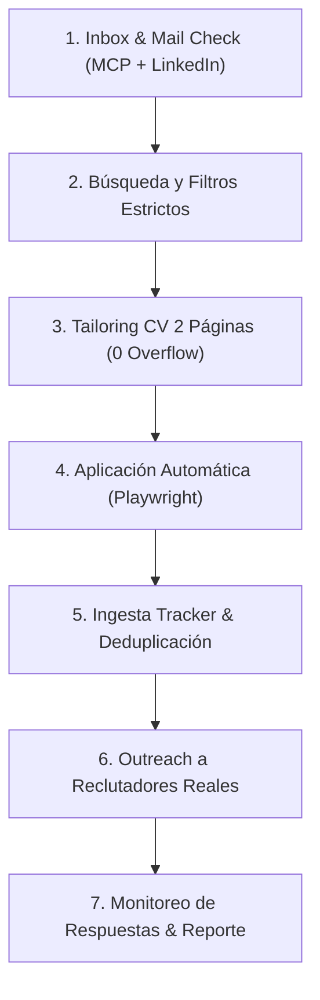

# Insanus-Jobs — Autonomous Job Search & Application Command Center

Este repositorio contiene un agente de IA autónomo diseñado para buscar ofertas de empleo, adaptar CVs a medida de 2 páginas (sin desbordes), postular automáticamente mediante LinkedIn Easy Apply, contactar reclutadores reales y monitorear respuestas por correo y LinkedIn.

---

## 🎯 El Flujo Maestro: `/search-jobs`

El agente ejecuta un ciclo integral de 7 fases autónomas:

### Las 7 Fases de Ejecución:

1. **Fase 1: Chequeo de Respuestas e Inbox (`scripts/check_inbox.mjs`)**
   - Inspecciona Gmail vía Google Workspace MCP (`gmail.search`) buscando entrevistas, llamadas y pruebas técnicas.
   - Inspecciona LinkedIn en `data/session/persistent_chrome`: mensajes directos no leídos, notificaciones y solicitudes de conexión enviadas.
   - Actualiza automáticamente `data/applications.md` si hubo respuestas.

2. **Fase 2: Búsqueda y Filtrado (`scripts/linkedin_search.mjs`)**
   - Busca vacantes activas en LinkedIn Easy Apply aplicando los filtros de rol, modalidad y piso salarial de `config/profile.yml`.
   - Evalúa el fit técnico de las vacantes y descarta puestos no técnicos.

3. **Fase 3: Confección de CVs de 2 Páginas (`scripts/generate_pdf.mjs`)**
   - Genera el CV HTML a medida basado en `templates/cv-template.html`.
   - Verifica paginación estricta con `node scripts/check_cv_format.mjs`: **EXACTAMENTE 2 páginas y 0px de desborde**.
   - Compila el PDF en `output/cv-[empresa]-[rol].pdf` con normalización ATS.

4. **Fase 4: Postulación Automática (`scripts/linkedin_apply.mjs`)**
   - Conecta a Chromium persistente con perfil autenticado.
   - Completa cuestionarios de screening con los datos del perfil y adjunta el PDF generado.
   - Guarda capturas de revisión y confirmación en `data/session/[slug]_submitted_success.png`.

5. **Fase 5: Ingesta en el Tracker (`scripts/merge_tracker.mjs` y `scripts/verify_pipeline.mjs`)**
   - Registra la postulación en `data/applications.md` con puntaje, fecha y enlace al informe.
   - Ejecuta validación de integridad (`verify_pipeline.mjs`) garantizando 0 errores.

6. **Fase 6: Outreach a Reclutadores Reales (`scripts/recruiter_outreach.mjs`)**
   - **Regla Ética Estricta:** Prohibido inventar correos genéricos (`careers@`, `info@`).
   - Envía solicitudes de conexión con nota personalizada en LinkedIn a reclutadores reales de IT/HR.
   - Si existe una casilla real y verificada de la empresa, despacha el correo directamente vía Google Workspace MCP (`gmail.send`).

7. **Fase 7: Monitoreo Final y Confirmación**
   - Revisa acuses de recibo en Gmail y genera el reporte ejecutivo final para el usuario.

---

## 🛠️ Herramientas Funcionales (`scripts/`)

| Script | Función en el Pipeline |
|---|---|
| `scripts/check_inbox.mjs` | Monitor unificado de respuestas (Gmail MCP + LinkedIn) |
| `scripts/check_recruiter_responses.mjs` | Inspección detallada de respuestas en Gmail y chats |
| `scripts/check_linkedin_inbox.mjs` | Inspección de mensajes, notificaciones e invitaciones enviadas |
| `scripts/linkedin_search.mjs` | Búsqueda y extracción de vacantes LinkedIn Easy Apply |
| `scripts/linkedin_apply.mjs` | Form filler automatizado para Easy Apply |
| `scripts/generate_pdf.mjs` | Compilador Playwright HTML → PDF con normalización ATS |
| `scripts/check_cv_format.mjs` | Validador estricto de 2 páginas con 0 overflow |
| `scripts/recruiter_outreach.mjs` | Envío de correos de presentación vía Google Workspace MCP |
| `scripts/linkedin_send_connect.mjs` | Envío automatizado de invitaciones con nota a reclutadores |
| `scripts/verify_pipeline.mjs` | Health check y verificación de integridad del tracker |
| `scripts/merge_tracker.mjs` | Fusiona nuevas postulaciones con `data/applications.md` |
| `scripts/translate_cv.mjs` | Traductor de CVs preservando estructura HTML |
| `scripts/profile_loader.mjs` | Cargador de perfil dinámico (`config/profile.yml`) |

---

## 🔒 Privacidad y Datos Personales

- **Los datos personales NUNCA se suben al repositorio:**
  - `config/profile.yml` (se incluye `config/profile.example.yml`)
  - `cv.md` (se incluye `cv.example.md`)
  - `cv.html` (se incluye `examples/sample-cv.html`)
  - `data/applications.md` (se incluye `data/applications.example.md`)
  - `data/session/` (sesión persistente de Chrome, cookies, screenshots)
  - `output/` y `reports/` (documentos generados)
- Todos los scripts leen dinámicamente desde `config/profile.yml` y tienen valores de respaldo limpios.
